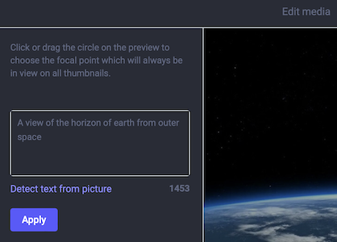

# mastodon-soft
It's the default Mastodon Dark theme, but with a softer textbox both for posting and for alt img captioning.

## Screenshots



## Installing
I'm using `$MASTODON_ROOT` to describe the install dir. It might be `/home/mastodon/live` if you followed the initial instructions.

1. Copy `theme/mastodon-soft/` and `theme/mastodon-soft.scss` to `$MASTODON_ROOT/app/javascript/styles`
2. Define the style in `$MASTODON_ROOT/config/themes.yml`:
   ```
   [other themes]
   mastodon-soft: styles/mastodon-soft.scss
   ```
3. Define the style name in `$MASTODON_ROOT/config/locales/en.yml`:
   ```
   en:
     [other stuff]
     themes:
        [other themes]
         mastodon-soft: Mastodon (Dark, Softer)
    ```
4. Build the assets: `RAILS_ENV=production bundle exec rails assets:precompile`
5. Restart: `sudo systemctl restart mastodon-web`

After that you can go to your appearance preferences in the Web UI (`/settings/preferences/appearance`) and select "Mastodon (Dark, Soft)" and you're good to go.

## Known Issues
* Theres some odds and ends that dont match the theme (got a little fancy with `.emoji-mart-bar`), and probably other things I missed.
* The moderation interface is admittedly not very soft.

Contributions are welcome!

# License
mastodon-soft: a softer theme for Mastodon\
Original code Copyright (C) 2016-2023 Eugen Rochko & other Mastodon contributors\
Modifications Copyright (C) 2023 Big Technology LLC

This program is free software: you can redistribute it and/or modify
it under the terms of the GNU Affero General Public License as published by
the Free Software Foundation, either version 3 of the License, or
(at your option) any later version.

This program is distributed in the hope that it will be useful,
but WITHOUT ANY WARRANTY; without even the implied warranty of
MERCHANTABILITY or FITNESS FOR A PARTICULAR PURPOSE.  See the
GNU Affero General Public License for more details.

You should have received a copy of the GNU Affero General Public License
along with this program.  If not, see <http://www.gnu.org/licenses/>.